<p align="center">


</p>
# Comparative Nonlinear High-Sideslip Vehicle Stabilization

### PID vs Fixed LQR vs Gain-Scheduled LQR vs Constrained MPC with EKF State Estimation

**Author:** Ruddrho Mollik  
**Platform:** MATLAB  
**Final Validated Run:** 30 September 2026  
**Validation Status:** PASS


> This repository is a simulation and control-engineering research
> project. It is not a real-vehicle operating guide, and the controllers
> have not been validated on a physical vehicle.

<figure>
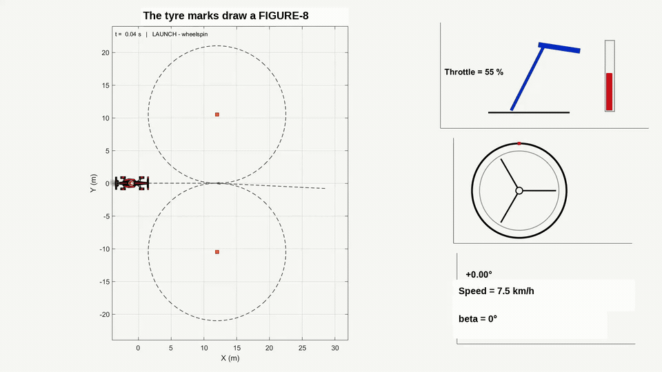
<figcaption aria-hidden="true">Final 16:9 simulation</figcaption>
</figure>

## Abstract

This project develops a reproducible MATLAB framework for nonlinear
high-sideslip vehicle stabilization and compares four feedback-control
strategies: PID, fixed LQR, gain-scheduled LQR (GS-LQR), and constrained
MPC. The nonlinear validation plant is a planar four-wheel
rear-wheel-drive model with individual Fiala-type tyre forces,
longitudinal/lateral friction sharing, quasi-static load transfer,
aerodynamic and rolling resistance, and steering/throttle actuator
dynamics. An EKF is evaluated for output-feedback operation.

The research benchmark uses a steady high-sideslip operating point of
approximately **32 km/h and -35° sideslip**. Six standardized
experiments test nominal tracking, reduced friction, crosswind
disturbance, payload/model mismatch, high sensor noise, and a combined
challenge. A matched **100-case Monte Carlo study per controller**
reuses the same randomized vehicle/tyre parameter realizations across
all controllers.

The final V3 numerical validation gate passed. Fixed LQR and GS-LQR
succeeded in all six standardized scenarios and achieved 100% success in
the matched Monte Carlo study. Constrained MPC succeeded in three of six
standardized scenarios and achieved 87% Monte Carlo success. The PID
baseline did not satisfy the predefined high-sideslip stabilization
criterion. Under high sensor noise, adding the EKF reduced MPC sideslip
RMSE from **43.587° to 0.221°**, a **99.49% reduction** relative to
raw-sensor feedback. These results apply only to this model, tuning,
uncertainty set, and experiment design.

## Research contributions

1.  Nonlinear four-wheel validation plant with per-wheel saturating tyre
    forces and friction-envelope sharing.
2.  Fair four-controller benchmark using common references, disturbance
    timing, actuator model, and random seeds.
3.  Separation of controller-law tests from estimator-dependent
    output-feedback tests.
4.  Six deterministic scenarios spanning friction, disturbance, model
    mismatch, sensor noise, and combined stress.
5.  Matched 100-case Monte Carlo uncertainty study for every controller.
6.  EKF estimator ablation and MPC command-rate-constraint ablation.
7.  Controllability, observability, local pole, computation-time, and
    reproducibility checks.
8.  Separate Figure-8 drift demonstration with an F1-style
    visualization, HUD, tyre marks, and car-attached smoke.

## Validation summary

The final gate reports baseline success
`[PID, Fixed LQR, GS-LQR, MPC] = [0, 1, 1, 1]`, finite baseline and
Monte Carlo metrics, successful advanced nominal stabilization, and a
final **PASS** status. PID is deliberately retained as a comparison
baseline; its failure does not invalidate the experiment.

## Nonlinear vehicle model

The validation state is
`x = [X, Y, psi, vx, vy, r, deltaAct, throttleAct]`. The front axle
steers and the rear axle provides drive force. Each wheel receives its
own normal load, slip angle, Fiala lateral force, longitudinal drive
contribution, and combined-force utilization. The plant also includes
first-order steering/throttle actuators and a physical steering-rate
limit.

Nominal parameters include 1280 kg mass, 2100 kg m² yaw inertia, 2.60 m
wheelbase, 1.55 m track width, friction coefficient 1.12, front/rear
axle cornering stiffnesses of 76/82 kN/rad, maximum drive force 12 kN,
and maximum steering 38°.

## Control and estimation architecture

### PID baseline

Equilibrium feedforward is combined with sideslip/yaw and speed
corrections. It is kept as a conventional comparison baseline.

### Fixed LQR

A custom continuous-time Riccati implementation generates state feedback
around a representative high-sideslip equilibrium using
`[vx, vy, r, deltaAct, throttleAct]`.

### Gain-Scheduled LQR

GS-LQR interpolates local gains across 30/35/40 km/h and absolute
sideslip angles of 30°/35°/40°.

### Constrained MPC

The custom MPC uses a scheduled local linear prediction model, 10-step
horizon, 16 projected-gradient iterations, input constraints, and
explicit steering/throttle command-rate constraints.

### Extended Kalman Filter

The EKF estimates the dynamic state from simulated speed, yaw-rate,
lateral-acceleration, steering-position, and throttle measurements.
High-noise and combined scenarios use common EKF output feedback for all
controllers.

## Experimental protocol

The research benchmark runs for 24 s at 0.02 s. Monte Carlo runs use
0.04 s. Random seed: `20260930`.

The first four deterministic scenarios use truth-state feedback to
isolate controller-law performance. High-noise and combined scenarios
use EKF output feedback. The Monte Carlo experiment isolates matched
parametric model mismatch and does not stack the deterministic
disturbance events.

## Standardized scenario matrix

| Scenario                          |       PID | Fixed LQR |   GS-LQR | Constrained MPC |
|-----------------------------------|----------:|----------:|---------:|----------------:|
| Dry-road baseline                 | 32.291° ✗ |  0.001° ✓ | 0.001° ✓ |        0.013° ✓ |
| Wet-road friction drop            | 89.716° ✗ |  3.926° ✓ | 3.834° ✓ |       31.966° ✗ |
| Crosswind impulse                 | 32.347° ✗ |  0.211° ✓ | 0.210° ✓ |        6.706° ✗ |
| +15% mass / +10% inertia mismatch | 32.522° ✗ |  0.314° ✓ | 0.323° ✓ |        1.097° ✓ |
| High sensor noise                 | 40.355° ✗ |  0.176° ✓ | 0.173° ✓ |        0.259° ✓ |
| Combined worst-case challenge     | 88.850° ✗ |  4.791° ✓ | 4.676° ✓ |       28.966° ✗ |

Values are sideslip-angle RMSE; ✓/✗ indicates the predefined simulation
success criterion.

<figure>
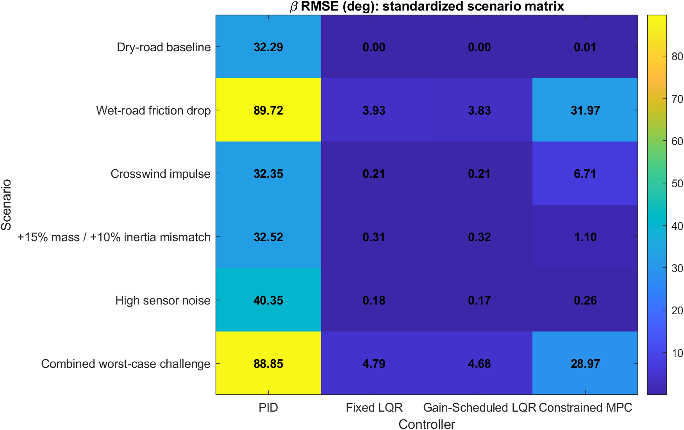
<figcaption aria-hidden="true">Scenario matrix</figcaption>
</figure>

## Baseline results

| Controller         | Beta RMSE (deg) | Yaw RMSE (deg/s) | Speed RMSE (km/h) | Mean compute (ms) | Result |
|--------------------|----------------:|-----------------:|------------------:|------------------:|-------:|
| PID                |       32.291118 |        99.678194 |          1.424456 |          0.003305 |   FAIL |
| Fixed LQR          |        0.001446 |         0.005130 |          0.001484 |          0.005494 |   PASS |
| Gain-Scheduled LQR |        0.000938 |         0.003766 |          0.001021 |          0.024218 |   PASS |
| Constrained MPC    |        0.012860 |         0.013080 |          0.012910 |          0.472759 |   PASS |

<figure>
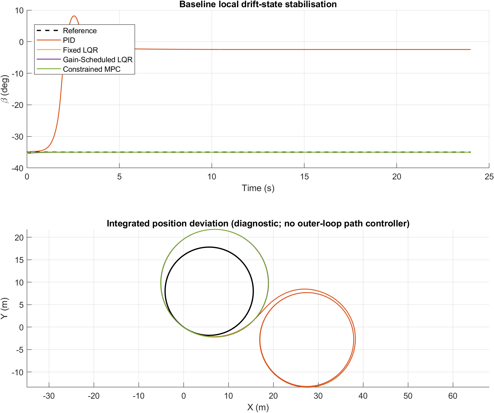
<figcaption aria-hidden="true">Baseline tracking</figcaption>
</figure>

The advanced controllers stabilize the nominal research equilibrium. The
extremely small LQR-family errors reflect a local equilibrium-regulation
task inside the controller design envelope and are not physical-vehicle
accuracy claims.

## Robustness results

<figure>
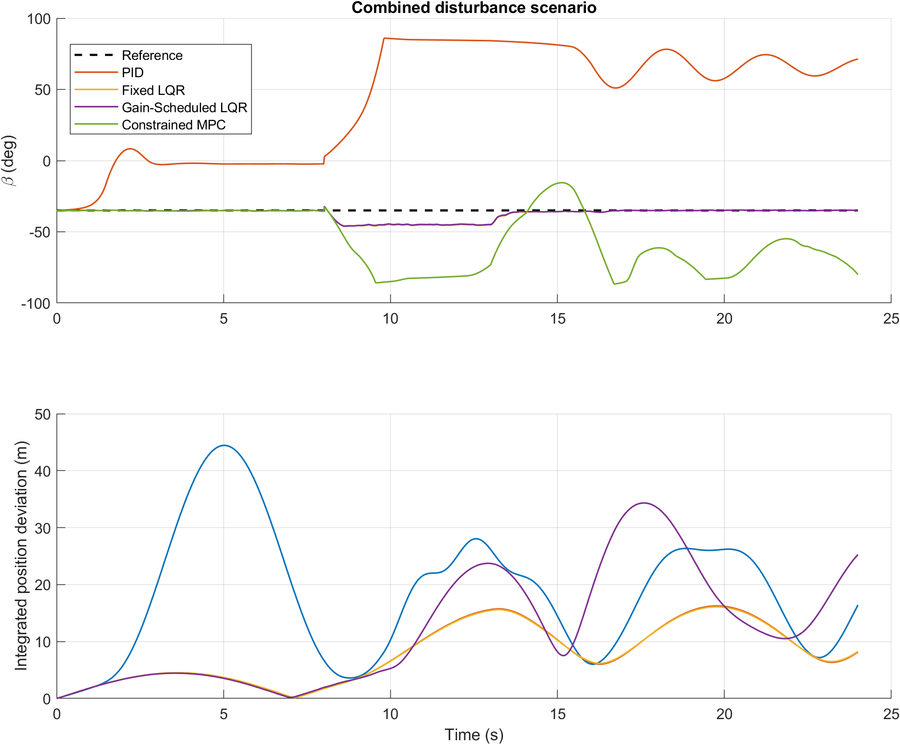
<figcaption aria-hidden="true">Combined robustness</figcaption>
</figure>

Fixed LQR and GS-LQR pass all six standardized scenarios. Constrained
MPC passes dry baseline, payload/model mismatch, and high sensor noise,
but fails the predefined criterion in wet-road, crosswind, and combined
cases. PID fails all six.

## Matched Monte Carlo robustness

| Controller         | Mean beta RMSE |   Std. |     P95 |   Worst | Success |
|--------------------|---------------:|-------:|--------:|--------:|--------:|
| PID                |        35.180° | 3.590° | 40.012° | 40.375° |      0% |
| Fixed LQR          |         1.690° | 1.279° |  4.080° |  6.623° |    100% |
| Gain-Scheduled LQR |         1.640° | 1.240° |  3.938° |  6.391° |    100% |
| Constrained MPC    |         4.439° | 5.245° |  9.853° | 36.695° |     87% |

<figure>
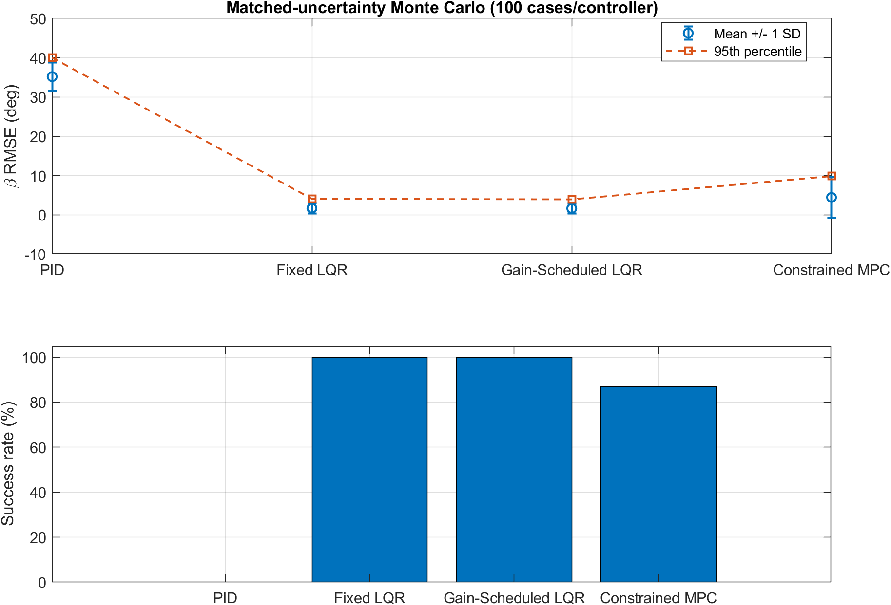
<figcaption aria-hidden="true">Monte Carlo statistics</figcaption>
</figure>

Every controller receives the same 100 randomized parameter cases. Fixed
LQR and GS-LQR both achieve **100% success**. GS-LQR has the lowest
mean, P95, and worst-case sideslip RMSE in this uncertainty set.
Constrained MPC achieves **87% success** and has a heavier error tail.
PID achieves 0%.

## EKF ablation

| Feedback     | Beta RMSE (deg) | Yaw RMSE (deg/s) | Speed RMSE (km/h) | Result |
|--------------|----------------:|-----------------:|------------------:|--------|
| Truth states |        0.012860 |         0.013080 |          0.012910 | PASS   |
| Raw sensors  |       43.586948 |        90.114104 |         27.789735 | FAIL   |
| MPC + EKF    |        0.220668 |         0.567298 |          0.185018 | PASS   |

<figure>
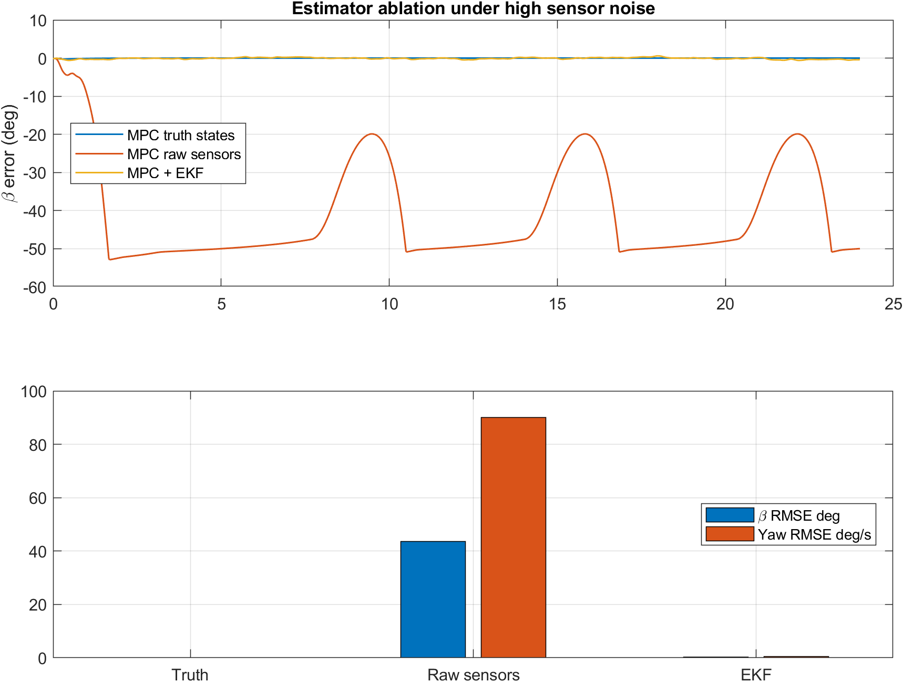
<figcaption aria-hidden="true">EKF ablation</figcaption>
</figure>

The EKF reduces sideslip RMSE by **99.49%** relative to raw-sensor
feedback in the defined high-noise experiment.

## MPC command-rate-constraint ablation

| Variant                              | Beta RMSE (deg) | Command-rate exceedances | Result |
|--------------------------------------|----------------:|-------------------------:|--------|
| MPC without explicit slew constraint |       19.695724 |                      540 | FAIL   |
| Constrained MPC                      |       30.081924 |                        0 | FAIL   |

The explicit MPC rate constraint removes raw command-rate exceedances,
but it does not restore acceptable tracking in the severe combined
challenge. Constraint compliance and disturbance-tracking performance
are different objectives.

## Local control-system analysis

The five-state augmented local model is numerically controllable and
observable: **controllability rank 5/5**, **observability rank 5/5**.
The reported fixed-LQR local poles all have negative real parts.

<figure>
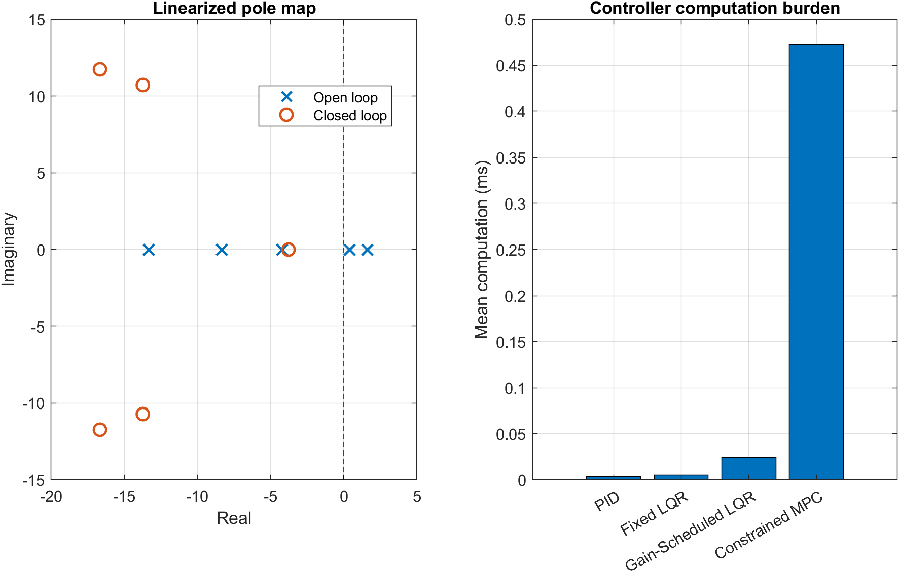
<figcaption aria-hidden="true">Stability and computation</figcaption>
</figure>

| Controller         | Mean compute time (ms) | Maximum compute time (ms) |
|--------------------|-----------------------:|--------------------------:|
| PID                |               0.003305 |                  0.032100 |
| Fixed LQR          |               0.005494 |                  0.062100 |
| Gain-Scheduled LQR |               0.024218 |                  0.151300 |
| Constrained MPC    |               0.472759 |                  1.119300 |

These are implementation- and hardware-dependent measurements from this
MATLAB run.

## Figure-8 drift demonstration

The research benchmark and visual demonstration are intentionally
different experiments. The **equilibrium-search target** for the visual
setup is **29.6 km/h and -30° sideslip**. The choreographed Figure-8 then
uses a **28.8 km/h nominal display speed**, with sideslip intentionally
varying through the stunt sequence (approximately **-40° to +35°**).
The saved equilibrium is approximately **9.82 m radius, -17.2° steering,
and 35.8% throttle** before the choreography begins.

<figure>
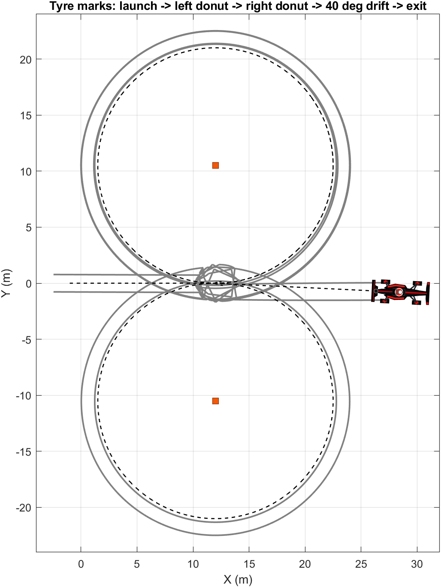
<figcaption aria-hidden="true">Figure-8 trajectory</figcaption>
</figure>

### State history

<figure>
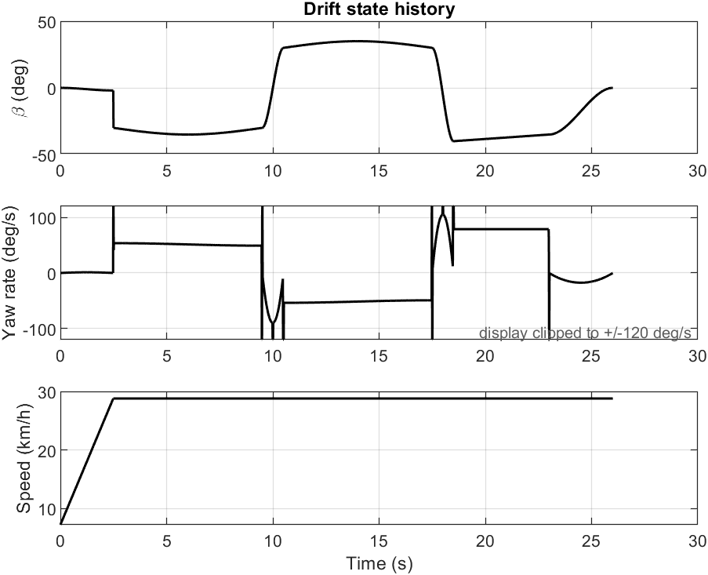
<figcaption aria-hidden="true">Drift state history</figcaption>
</figure>

For readability, the **visual-demo yaw-rate panel is display-clipped to
±120 deg/s** so short derivative spikes at piecewise choreography
transitions do not compress the useful scale. The raw values remain
unchanged in `outputs/simulation_data.mat`; this display treatment does
not affect the research benchmark or controller results.

### Steering and throttle

<figure>
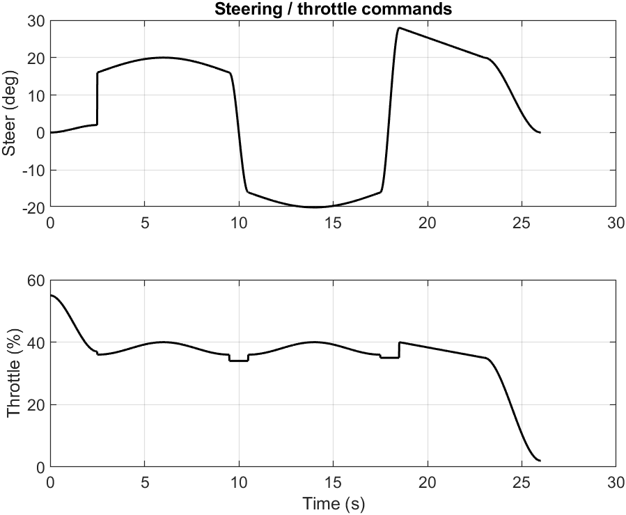
<figcaption aria-hidden="true">Control commands</figcaption>
</figure>

### Fiala tyre forces / friction sharing

<figure>
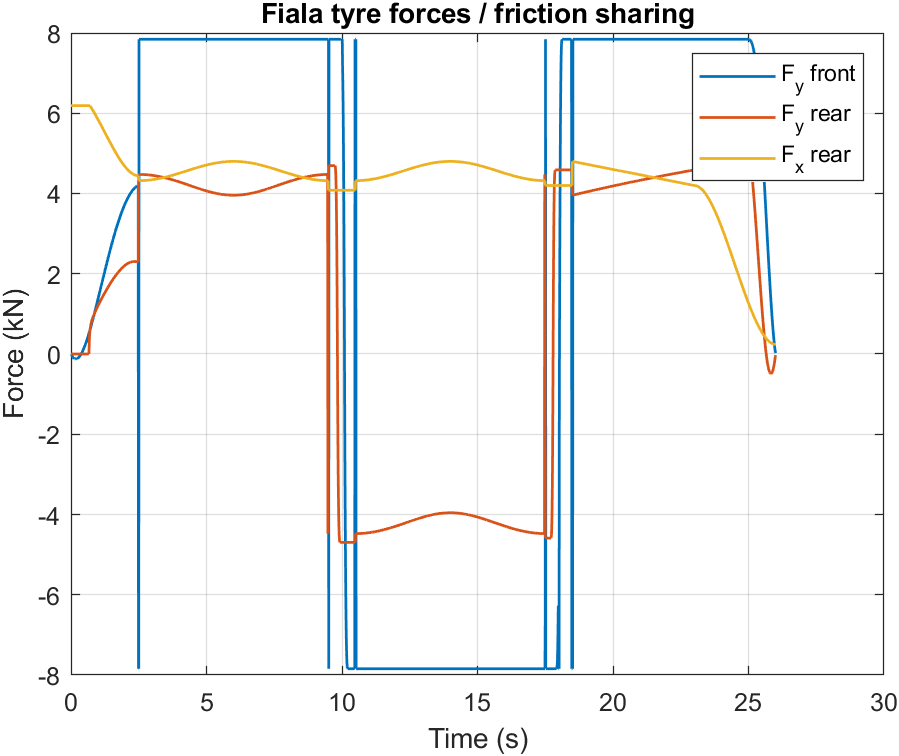
<figcaption aria-hidden="true">Tyre forces</figcaption>
</figure>

### Final reference frame

<figure>
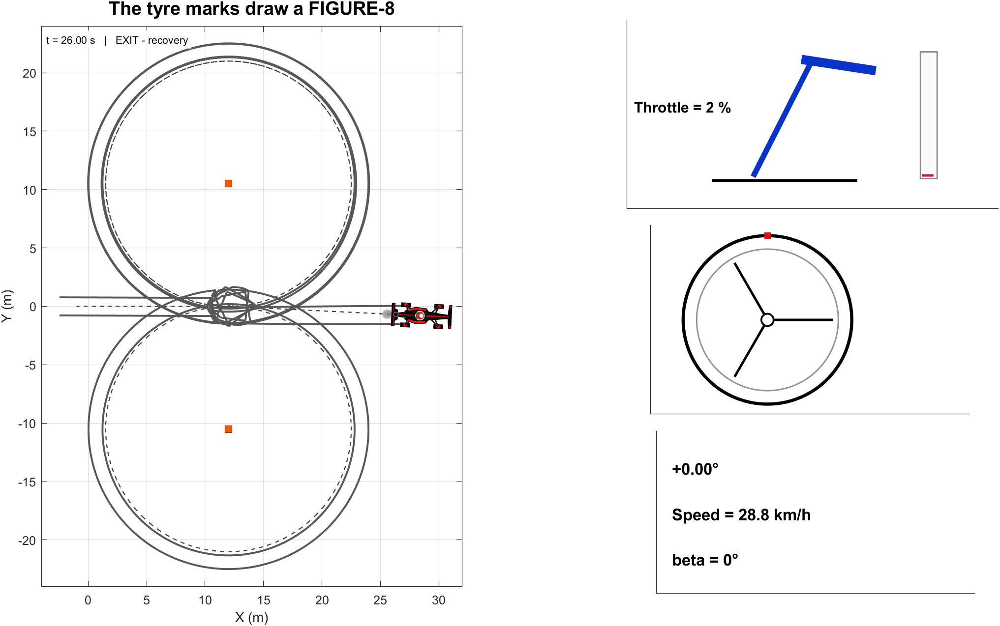
<figcaption aria-hidden="true">Final reference frame</figcaption>
</figure>

The validated recording is available as
[`outputs/drift_simulation_16x9.mp4`](outputs/drift_simulation_16x9.mp4).

The HUD reports total vehicle **Speed** (not longitudinal `Vx`), normalizes
near-zero sideslip to `0°`, and the recorder disables MATLAB interaction
toolbars so they are not captured in the GitHub video.

## Reproducibility

Use MATLAB with the repository root as Current Folder and run:

``` matlab
self_test
generate_paper_results
main
record_github_video
```

Expected evidence is `SELF_TEST_OK.txt`, a PASS validation gate, final
research figures/CSV tables, the supporting visual outputs,
`simulation_data.mat`, and the 16:9 MP4.

The two large generated V7.3 workspace files
(`paper_validation_results.mat` and `paper_validation_workspace.mat`)
are intentionally excluded from this GitHub package to keep it compact.
Running `generate_paper_results` regenerates them.

## Repository structure

``` text
.
├── README.md
├── CITATION.cff
├── references.bib
├── FINAL_RUN_ORDER.txt
├── main.m
├── self_test.m
├── generate_paper_results.m
├── record_github_video.m
├── record_simulation_video.m
├── lib/
├── outputs/
│   ├── paper_results_v3/
│   ├── trajectory.png
│   ├── states.png
│   ├── controls.png
│   ├── tire_forces.png
│   ├── reference_final_frame.png
│   ├── simulation_data.mat
│   ├── drift_simulation_16x9.mp4
│   └── drift_simulation_16x9.gif
└── docs/
    ├── FINAL_RESEARCH_REPORT.pdf
    └── FINAL_RESEARCH_REPORT.md
```

## Interpretation

This project does not establish a universal controller ranking. Under
this particular nonlinear plant, operating envelope, tuning, and
uncertainty set, the LQR-based designs are the most consistent.
Constrained MPC provides excellent nominal regulation and explicit
command-rate compliance but is more sensitive to severe
friction/disturbance mismatch. The EKF is essential for the tested
high-noise MPC output-feedback case.

## Limitations

- MATLAB simulation only; no physical vehicle, HIL, or experimental
  tyre-data validation.
- Simplified planar vehicle, load-transfer, and tyre representations.
- Local high-sideslip stabilization rather than autonomous global path
  tracking.
- MPC uses a local linear prediction model, finite horizon, and finite
  projected-gradient iterations.
- Tuning is specific to the declared operating envelope.
- Monte Carlo uncertainty covers selected parameters, not every
  uncertainty source.
- Computation times depend on MATLAB, host hardware, and implementation
  details.
- Raw command-rate exceedances for non-MPC controllers are diagnostic;
  the nonlinear plant still contains physical actuator dynamics/rate
  limiting.

## Final research report

- **[PDF report](docs/FINAL_RESEARCH_REPORT.pdf)**
- **[Markdown report](docs/FINAL_RESEARCH_REPORT.md)**

## References

1.  R. Rajamani, *Vehicle Dynamics and Control*, 2nd ed., Springer,
    2012.
2.  H. B. Pacejka, *Tire and Vehicle Dynamics*, 3rd ed.,
    Butterworth-Heinemann, 2012.
3.  J. B. Rawlings, D. Q. Mayne, and M. M. Diehl, *Model Predictive
    Control: Theory, Computation, and Design*, 2nd ed., Nob Hill
    Publishing, 2017.
4.  D. Simon, *Optimal State Estimation: Kalman, H-infinity, and
    Nonlinear Approaches*, Wiley, 2006.
5.  C.-T. Chen, *Linear System Theory and Design*, 4th ed., Oxford
    University Press, 2013.

## Author

**Ruddrho Mollik**
